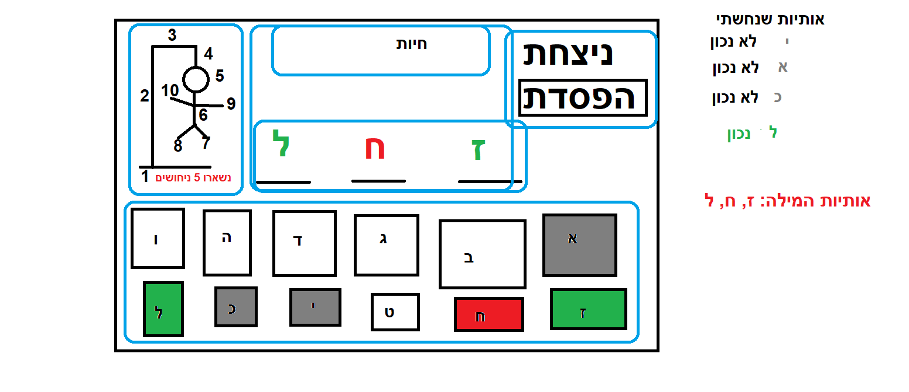
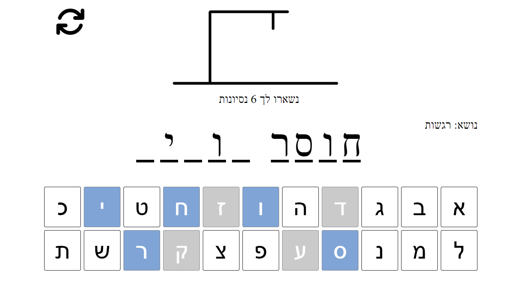
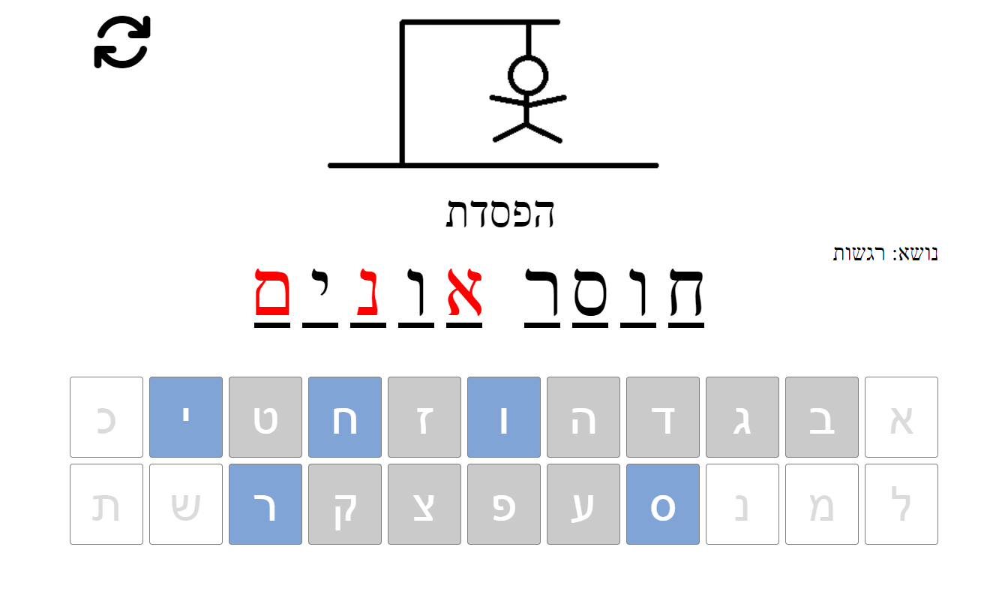
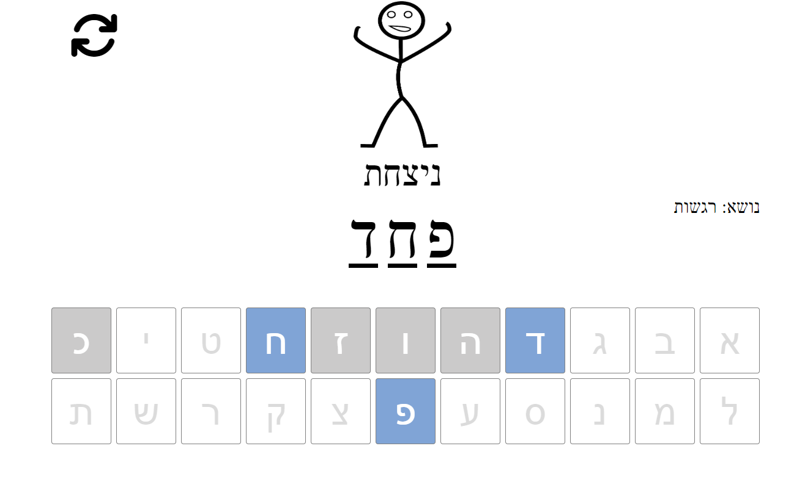
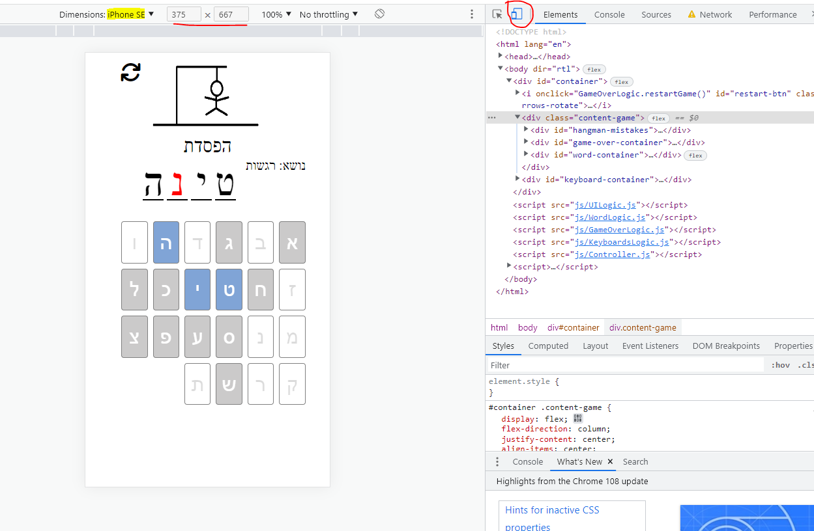
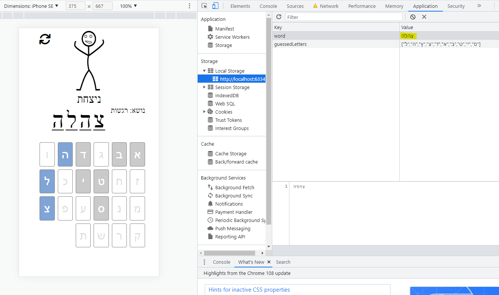

# Hangman web game

A simple web game, develop by HTML, CSS (SCSS), JS <br/>
For the nostalgic game [Hangman](https://he.wikipedia.org/wiki/%D7%90%D7%99%D7%A9_%D7%AA%D7%9C%D7%95%D7%99) <br>
<br>
Try it out with [Live Demo](https://hdriel.github.io/hangman-game-web/)

## Note!! it's a part from my: `Just Like That Bootcamp!` <br> So, I don't improve my code here! <br> to allow my students getting access to original project as they saw

## How to play
The computer choose a random word <sub>(support multiple language: English, Hebrew)</sub> from some subject. <sub>(configurable in next section)</sub> <br>
then the word display on screen with amount of invisible chars. <br>
the player _you_ need to guess chars from the missing word by click on the char button lists <br>  
game over is in the following cases: 
* have been 10 mistake you have done - then you loos
* or you will guess the missing word/s - then you won

**Note:** Adaptive for Desktop, Tablets and Phones

### Configuration
there is a setting configuration you can do in the game, on programming level
You can change only the following code in the file: `js/consts.js`

```javascript
// the amount of mistakes, maximum 10
const MAX_MISTAKES = 10; 

// value is on of ['HEB', 'ENG']
const GAME_WORD_LANG = 'HEB'; 

// value 0, on ENG is for "Animal"
// value 0, on HEB is for "חיות"
// value 1, on HEB is for "רגשות"
const WORD_LIST_INDEX = 1;
```

## How to Run
First getting the updated css styles and then run you project
(If `styles/css/styles.css` not exists)
1. run `npm install`
2. run `npm run sass`
3. open file `index.html` in your Chrome browser

Or try to play here in [Live Demo](https://hdriel.github.io/rock-paper-scissors-web/)

## Planning and Output
This project was planed before starting develop and made the following layout: 


### The final Result is:


<hr>



<hr>



<hr>



<hr>




## Tech and Skills
* Development styles with [SASS](https://sass-lang.com/) by separated into component styles <br>
* Write scripts by control approach, each controller responsibility on one rule
  - that eventually not make easy development, but I learn from that to next time develop in more efficiently way 
  - you can check out a better project on mine: [Rock, Paper and Scissors Web Game](https://github.com/hdriel/rock-paper-scissors-web)
* Dynamically UI, That load buttons in multiple language: `Hebrew` / `English`
* Support @media-query for responsibility layers like Desktop, Tablet and Phones
* Saving data on local-storage for persist data, reload page will continue from where you stopped
* You can review my code starting from `js/controller.js` file
